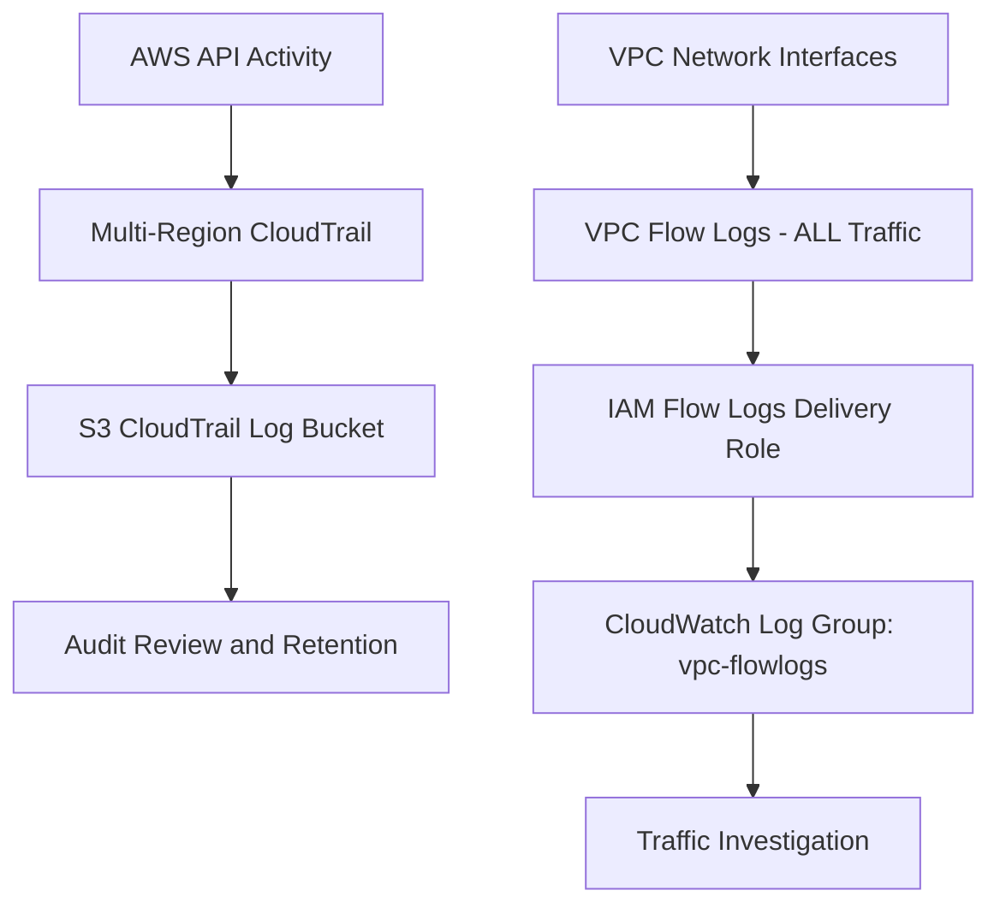

# Logging Architecture

## Log Uses

| Source | Useful For |
|---|---|
| CloudTrail | Who performed an AWS API action, when, from where, and against which resource |
| VPC Flow Logs | Source/destination analysis, port/protocol review, and accepted/rejected traffic investigation |

Production improvements include encryption, retention policies, least-privilege access, CloudTrail validation, and alerts for high-risk events.
