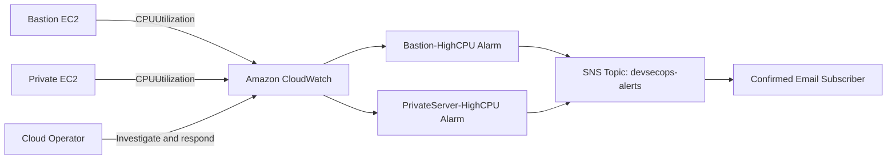

# Monitoring Architecture

## Detection Logic

- Metric: `AWS/EC2 CPUUtilization`
- Statistic: average
- Period: five minutes
- Threshold: greater than 80 percent
- Action: publish to SNS

The lab validates detection by generating temporary CPU load and observing alarm state transitions and email delivery.
