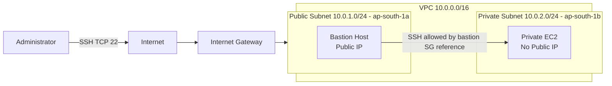

# Network Architecture

## Design Notes

- The public route table sends `0.0.0.0/0` to the Internet Gateway.
- The private route table contains no Internet default route.
- The private security group accepts SSH only from the bastion security group.
- Production hardening should restrict bastion ingress or replace it with Session Manager.
