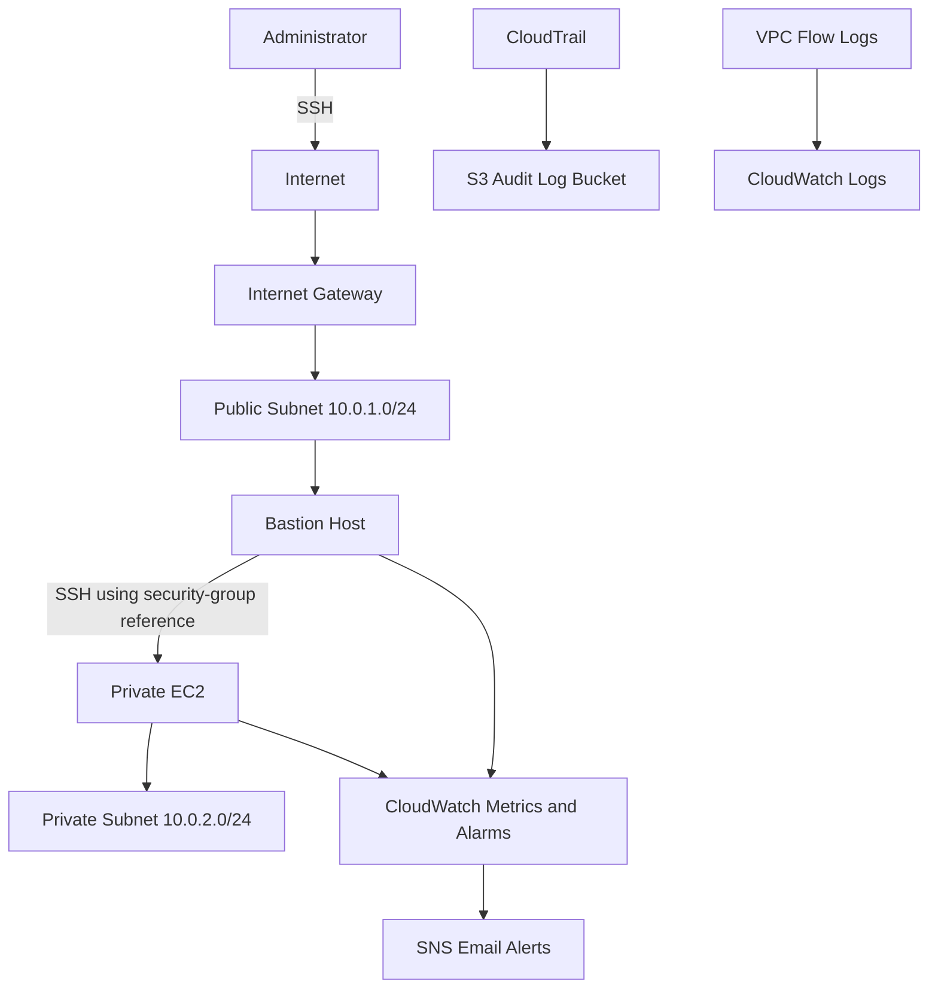

# AWS DevSecOps Security Lab


## Project Overview

This portfolio project builds a security-focused AWS environment with Terraform. It demonstrates how to design a segmented VPC, protect a private EC2 workload behind a bastion host, monitor compute health, deliver operational alerts, audit AWS API activity, and capture network traffic metadata.

The repository combines Infrastructure as Code with guided AWS, Linux, Git, monitoring, and security labs. It is designed to support Cloud Engineer, DevOps Engineer, and Cloud Security Engineer interview discussions.

## Features

- Reproducible AWS infrastructure provisioned with Terraform
- Public and private subnet segmentation across two Availability Zones
- Bastion host access path for a private EC2 instance
- Security-group-based SSH access between trust zones
- CloudWatch CPU alarms with SNS email notifications
- Multi-Region CloudTrail logging to an S3 bucket
- VPC Flow Logs delivered to CloudWatch Logs
- IAM role and policy for flow-log delivery
- Validation, troubleshooting, and security guidance for every lab

## Architecture



See the detailed [network](Documentation/Architecture_Diagrams/network-architecture.md), [monitoring](Documentation/Architecture_Diagrams/monitoring-architecture.md), and [logging](Documentation/Architecture_Diagrams/logging-architecture.md) diagrams.

## AWS Services Used

| Service | Purpose |
|---|---|
| Amazon VPC | Isolated network and subnet segmentation |
| Amazon EC2 | Bastion host and private workload |
| Security Groups | Stateful instance-level traffic control |
| Internet Gateway | Internet connectivity for the public subnet |
| Amazon CloudWatch | Metrics, alarms, and centralized flow-log storage |
| Amazon SNS | Email alarm notifications |
| AWS CloudTrail | AWS API activity auditing |
| Amazon S3 | Durable CloudTrail log storage |
| AWS IAM | Flow Logs service role and permissions |
| VPC Flow Logs | Network traffic metadata and accept/reject visibility |

## Terraform Resources

The implementation uses `aws_vpc`, `aws_subnet`, `aws_internet_gateway`, `aws_route_table`, `aws_route_table_association`, `aws_security_group`, `aws_instance`, `aws_cloudwatch_metric_alarm`, `aws_sns_topic`, `aws_sns_topic_subscription`, `aws_s3_bucket`, `aws_s3_bucket_policy`, `aws_cloudtrail`, `aws_cloudwatch_log_group`, `aws_iam_role`, `aws_iam_role_policy`, and `aws_flow_log`.

## Repository Structure

```text
.
|-- AWS-Labs/                 # Ten guided AWS security labs
|-- Documentation/            # Project report, diagrams, and evidence
|-- Git-GitHub/               # Git and SSH workflow references
|-- Linux-Labs/               # Linux administration references
|-- Resume-Projects/          # Interview and resume-ready content
|-- Terraform/                # AWS Infrastructure as Code
|-- PROJECT_TIMELINE.md       # Learning and implementation sequence
`-- README.md
```

## Deployment Steps

> AWS resources can incur charges. Review the plan and destroy lab resources when finished.

1. Install Terraform 1.5 or later and configure AWS CLI credentials.
2. Confirm identity and region:

   ```bash
   aws sts get-caller-identity
   aws configure get region
   ```

3. Review the Terraform configuration, especially CIDR ranges, AMI, key pair, notification endpoint, and globally unique S3 bucket name.
4. Deploy:

   ```bash
   cd Terraform
   terraform init
   terraform fmt -check
   terraform validate
   terraform plan
   terraform apply
   ```

5. Confirm the SNS email subscription, validate resources, and collect screenshots.
6. Remove resources after testing:

   ```bash
   terraform destroy
   ```

Full command explanations are in [Terraform/README.md](Terraform/README.md).

## Screenshots

Evidence should demonstrate the VPC and subnets, route tables, EC2 instances, security groups, SSH connectivity, CloudWatch alarms, SNS subscription, CloudTrail delivery, S3 log objects, and VPC Flow Logs. Each lab contains a `screenshots/README.md` checklist.

## Learning Outcomes

- Designed a segmented AWS network with controlled ingress paths.
- Used Terraform to provision and manage cloud infrastructure consistently.
- Applied security groups as stateful controls between public and private tiers.
- Implemented metrics, alarms, notifications, audit logs, and network telemetry.
- Validated architecture through AWS CLI, console evidence, SSH, and log review.
- Identified production hardening priorities such as restricted bastion access, encrypted log storage, least-privilege IAM, and secret-free source control.

## Resume Highlights

- Built a Terraform-managed AWS DevSecOps environment integrating VPC, EC2, IAM, CloudWatch, SNS, CloudTrail, S3, and VPC Flow Logs.
- Designed a bastion-based access model that prevented direct Internet access to the private EC2 workload.
- Implemented operational monitoring, automated alerting, API auditing, and network traffic visibility.

See [Resume-Projects](Resume-Projects/) for additional ATS-friendly content and interview preparation.

## Future Improvements

- Restrict bastion SSH ingress to an approved administrator CIDR or replace SSH with AWS Systems Manager Session Manager.
- Remove private key material and Terraform state from version control; migrate state to an encrypted, locked remote backend.
- Encrypt S3 and CloudWatch Logs, enable S3 versioning, and configure retention and lifecycle policies.
- Add CloudTrail log-file validation, access logging, and alerting for high-risk API events.
- Narrow IAM policy resources and egress rules according to least privilege.
- Add NAT Gateway or VPC endpoints only where private workloads require controlled outbound access.
- Add CI checks for formatting, validation, Checkov/tfsec scanning, and secret detection.

## Security Notice

This repository is a learning environment. Before production use, review all identities, keys, state files, bucket names, email endpoints, AMIs, security-group rules, and account-specific values. Never commit private keys, credentials, or sensitive Terraform state.
